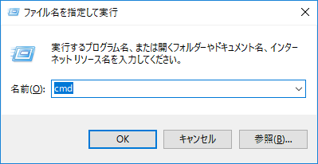

# 使用法
ライブラリをインストールするには、pip（The Python Package Installer）と呼ばれるツールを使用します。これによりインターネットを経由したインストールが簡単にできます。

## ライブラリのインストール
pipはコマンドで実行しますので、まずコマンドプロンプト（背景の黒い画面）を開きます。
1. コマンドプロンプトを開く
   1. 「Windowsキー + r 」を入力すると、以下のような画面が開きます。
        
        
   2. 「cmd」 と入力して OK をクリックするとコマンドプロンプトが開きます。
2. pip install を実行する
   
   今回はintlabをインストールしていきます。インストールするために、以下のコードをコマンドプロンプトにて入力していきます。
   ```bash
   pip install intlab
   ```


# Lineに通知するには
Line Notifyというツールを使用してメッセージを配信します。

## LINE Notifyとは
APIにより連携することで、外部Webサービスやアプリケーションなどからの通知をLINEアカウントのメッセージを通じてユーザーに配信できるサービスです。

毎度取得手順を忘れるので備忘録として残します。
手順等に間違いがございましたら、ご教示よろしくお願いいたします🙇‍♀️

## 準備物
LINEアカウント

## Lineでの作業
①[こちらのページ](https://notify-bot.line.me/ja/)にアクセス！

②ログインする


③マイページに入る


④トークンを発行を押下します。


⑤トークンを発行する、にてトークン名と通知を入力します（今回はIntlab）<br>
送信するトークルームを選択、発行するを押下します。


⑥トークンが発行されるため、必ずコピーをします。


## エディターでの作業
setupmacroを開く。


## Webページをアップデート方法
### 1.インストーラーのダウンロード
下記サイトからインストーラーをダウンロードします。
http://nodejs.org/

Download > Windows Installer をクリックするとカレントバージョンの自身のPCに合わせたインストーラーがダウンロードされます。
明示的に、32bit版、64bit版、バイナリ版など指定したい場合は、それぞれの項目をクリックするとダウンロードが開始します。


### 2.インストール
実行します。


Nextをクリック。


ライセンス規約へ同意しNextをクリック。


インストールフォルダを選択しNextをクリック。（インストール先は任意の場所でOKです）


インストールするコンポーネントを選択しNextをクリック。基本デフォルトでOKです。


Installをクリックでインストールが開始します。


特に問題がなければインストールが完了します。Finishをクリック。


コマンドプロンプトから下記のコマンドを実行します。
`node --version`

バージョンが表示されればインストールは成功です。


もうひとつ、npmも同時にインストールされているはずなのでこちらもチェックします。
コマンドプロンプトから下記のコマンドを実行します。
`npm --version`

こちらも、バージョンが表示されればインストールは成功です。


### Visual Studio Codeで拡張機能をインストール
次に拡張機能をインストールしていきます。


VSCodeの拡張機能にて「npm intellisense」をインストールします。


インストール後、使用するフォルダ内に移動し、ターミナルにて以下のコードを実行します。
```npm
npm -i
npm -run build
```
